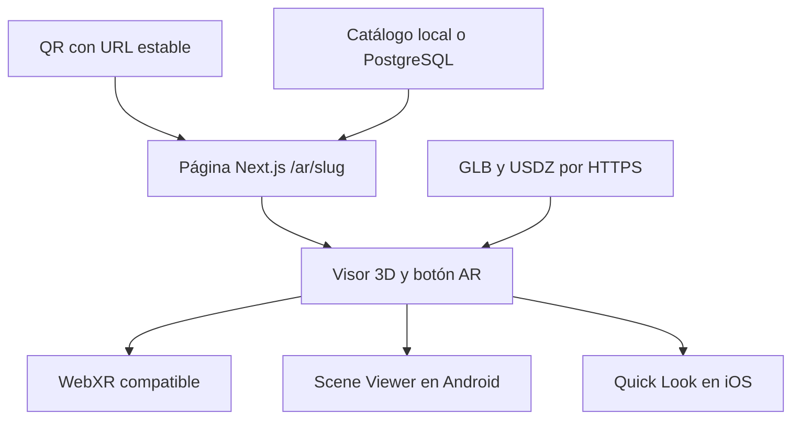

# Plan de implementación: modelo de Meshy en 3D y realidad aumentada mediante QR

**Documento para Claude Code**  
**Fecha:** 29 de septiembre de 2026  
**Proyecto provisional:** Trinion AR  
**Primer modelo:** Pichón Halloween creado en Meshy  
**Estado:** especificación de desarrollo; archivos 3D pendientes de entregar y validar.

## 1. Instrucción principal para Claude

Implementa una aplicación web con Next.js y TypeScript que permita escanear un QR con la cámara del teléfono, abrir la URL asociada y mostrar el modelo 3D correspondiente. Desde esa página, el usuario podrá activar la realidad aumentada para colocar el modelo en su entorno.

Lee todo este documento antes de modificar el proyecto. Si existe un repositorio, inspecciona sus instrucciones, estructura, dependencias y convenciones. Integra la solución sin reemplazar funcionalidades ajenas. Si es un proyecto nuevo, crea una base mínima con App Router.

Empieza por la **fase 1** y termina su recorrido funcional antes de añadir base de datos, almacenamiento externo o administración. Las fases siguientes definen el destino de la plataforma. Avanza con las tareas que no dependan de archivos o credenciales faltantes y registra los bloqueos concretos.

No declares que el pichón real funciona si sólo probaste un modelo de ejemplo. No declares validada la AR móvil mediante una captura de escritorio o un emulador. Entrega código, instrucciones reproducibles y un registro que diferencie resultados comprobados de verificaciones pendientes.

## 2. Experiencia que se debe construir

1. El usuario escanea un QR impreso utilizando la cámara normal de iPhone o Android.
2. Abre una URL HTTPS estable, por ejemplo: `https://DOMINIO_REAL/ar/pichon-halloween`.
3. La página carga el pichón de Meshy en un visor 3D.
4. Puede rotarlo y hacer zoom.
5. Pulsa **“Ver en tu espacio”**.
6. En un dispositivo compatible se inicia la experiencia AR correspondiente.
7. Sigue las indicaciones del visor para colocar el pichón sobre una mesa o el piso.
8. Puede observarlo desde diferentes ángulos moviendo el teléfono.

**Alcance del anclaje:** el modelo se coloca en una superficie del entorno. El QR identifica la experiencia; no actúa como marcador al que el pichón permanezca pegado. La entrada a AR depende de una acción del usuario y de la compatibilidad del dispositivo.

**Si se desea que el pichón siga una tarjeta o un QR físico:** aplicar la variante de tracking descrita en la sección 17. Ese requerimiento cambia el motor AR.

El QR contiene la URL de la página, no los bytes del modelo. Esa URL conserva su identidad aunque se cambien los archivos 3D.

## 3. Decisiones y supuestos iniciales

| Decisión | Valor para comenzar | Estado |
|---|---|---|
| Nombre comercial | Trinion AR | Provisional |
| Primer slug | `pichon-halloween` | Propuesto |
| Altura inicial del personaje completo | 0.30 metros, incluido el sombrero | Supuesto ajustable |
| Redimensionar en AR | Permitido | Supuesto ajustable |
| Superficie | Horizontal: mesa o piso | Alcance inicial |
| Animación | Modelo estático | Alcance inicial |
| Idioma | Español | Definido |
| Dominio | Configurable | Pendiente |
| Modelo GLB real | Exportación optimizada de Meshy | Pendiente |
| Modelo USDZ real | Misma versión y tamaño del GLB | Pendiente |
| Imagen de portada | PNG o WebP | Opcional |
| Público objetivo | iPhone/iPad y Android compatibles; escritorio para 3D | Definido |

Estos supuestos permiten desarrollar sin esperar todas las decisiones de diseño. No registrarlos como preferencias confirmadas del usuario.

**Información no verificada:** la conversación anterior reportó aproximadamente 809,534 triángulos y 435,647 vértices. No se han inspeccionado los archivos 3D ni confirmado estas cifras. La imagen de Meshy no sustituye una inspección del GLB.

## 4. Stack tecnológico

| Capa | Tecnología | Momento |
|---|---|---|
| Aplicación | Next.js App Router + React + TypeScript | Fase 1 |
| Interfaz | Tailwind CSS | Fase 1 |
| Visor | `@google/model-viewer` | Fase 1 |
| AR móvil | WebXR, Scene Viewer y Apple Quick Look, mediante el visor | Fase 1 |
| Activos | GLB para 3D/Android y USDZ para iOS | Fase 1 |
| QR | `qrcode`; tipos separados si la versión los requiere | Fase 1 |
| Validación de datos | Zod | Fase 1 |
| Hosting | Vercel con HTTPS | Fase 1 |
| Catálogo inicial | Configuración local tipada | Fase 1 |
| Base de datos | PostgreSQL de Supabase | Fase 2 |
| Acceso a datos | Prisma, compatible con el repositorio | Fase 2 |
| Archivos publicados | Cloudflare R2 con dominio HTTPS público | Fase 2 |
| Operaciones con R2 | SDK compatible con S3 y presigned uploads | Fase 2–3 |
| Autenticación administrativa | Supabase Auth + integración SSR vigente | Fase 3 |
| Estadísticas | Eventos propios en PostgreSQL | Fase 4 |
| Preparación del modelo | Meshy Remesh; Blender si hace falta | Antes de validación final |
| Pruebas web | Herramientas existentes; Playwright para flujos críticos | Durante implementación |

Resolver versiones estables y compatibles al iniciar, conservar el gestor de paquetes existente y guardar el lockfile. Documentar las versiones realmente instaladas. No copiar versiones de este plan: no se fijan números sin conocer el repositorio.

La API de Meshy no es necesaria para este flujo: se consumen los archivos exportados. Unity, una app nativa y un motor Three.js personalizado quedan fuera del MVP.

### Compatibilidad AR verificada en documentación

`<model-viewer>` ofrece los modos `webxr`, `scene-viewer` y `quick-look`. WebXR requiere HTTPS. Quick Look puede recibir un USDZ explícito con `ios-src`; también existe conversión automática, que no será la ruta principal del proyecto. Las interfaces HTML de la página no se trasladan a los visores nativos de Scene Viewer y Quick Look. [1]

Por ello, botones interactivos o animaciones futuras deben validarse por plataforma, sin prometer equivalencia entre todos los modos.

## 5. Qué entregar desde Meshy

### Archivos e información

| Entregable | Necesidad | Uso |
|---|---|---|
| `pichon-halloween.glb` | Necesario | Visor web y ruta AR Android |
| `pichon-halloween.usdz` | Necesario para certificar la ruta iOS prevista | Apple Quick Look |
| `pichon-halloween.webp` o PNG | Opcional | Portada y estado inicial |
| GLB original de alta resolución | Recomendado | Fuente para futuras optimizaciones |
| Tamaño deseado en centímetros | Confirmar | Normalización de escala |
| Permitir o impedir redimensionar | Confirmar | Configuración AR |
| Número final de triángulos y peso | Medir | Presupuesto de rendimiento |
| Texturas y materiales finales | Inspeccionar | Fidelidad y compatibilidad |
| GLB animado | Sólo para fase futura | Reproducción de una animación validada |

Meshy documenta exportación GLB y USDZ; GLB puede llevar las texturas incorporadas. [3]

### Preparación sugerida

1. Conservar el modelo original.
2. Crear una copia optimizada mediante Remesh. [4]
3. Probar un objetivo de aproximadamente 50,000 triángulos finales.
4. Comparar silueta, cara, pico, alas, ropa, sombrero y accesorios.
5. Si la calidad no basta, probar una versión mayor y medir en teléfono.
6. Exportar GLB y USDZ de la misma revisión.
7. Comprobar que ambos conservan colores, dimensiones y orientación.
8. Guardar las fuentes y registrar cómo se generó cada archivo.

Un objetivo de polígonos en Remesh no garantiza el mismo número de triángulos tras exportar: medir el resultado triangulado.

### Presupuesto de activos

Google recomienda para Scene Viewer 30,000–50,000 triángulos como rango ideal, hasta 100,000 como límite recomendado, texturas de máximo 2048×2048 y alrededor de 10 MB por modelo. Son pautas de optimización; no garantizan rendimiento en todos los teléfonos. La escala glTF es 1 unidad por metro. [2]

Aplicar estas pautas al GLB. Para el USDZ, fijar un presupuesto propio y medir carga en iPhone: no tratar el presupuesto de Android como una especificación de Apple.

Usar materiales PBR sencillos y un número reducido de materiales. Evitar incorporar compresión o extensiones nuevas antes de comprobar que el mismo activo abre en todas las rutas elegidas.

### Escala, orientación y apoyo

La altura inicial propuesta es 0.30 m para todo el personaje, incluido el sombrero.

- Medir la caja envolvente del GLB antes de exportar.
- Calcular factor de ajuste: `alturaObjetivo / alturaActual`.
- Aplicar el ajuste al activo preparado para distribución.
- Mantener al personaje erguido y ubicar su apoyo inferior de forma que no flote.
- Exportar el USDZ con la misma dimensión física.
- Revisar ambos activos sobre una superficie real.

El campo `heightMeters` del catálogo describe el activo preparado; no modifica su geometría por sí mismo. No depender de un `scale` aplicado sólo en el navegador para garantizar la dimensión del USDZ explícito.

Si únicamente se entrega una imagen, crear la aplicación y el estado “modelo pendiente”; no fabricar un GLB a partir de la captura ni presentar un modelo de ejemplo como el pichón real.

## 6. Arquitectura



La página pública sólo obtiene metadatos publicados. Los archivos grandes se sirven directamente desde almacenamiento/CDN en fases posteriores. No pasar los modelos por un Route Handler de Next.js en cada visualización.

Encapsular el catálogo con una función `getPublishedExperience(slug)`. Su contrato se conserva al cambiar de configuración local a PostgreSQL.

## 7. Fase 1: MVP con el pichón real

**Resultado:** un QR funcional abre la página del pichón y el usuario puede verlo en 3D y colocarlo en AR en dispositivos comprobados.

### Tareas

1. Revisar o crear el proyecto Next.js.
2. Incorporar el visor en un componente de cliente.
3. Crear `/ar/[slug]` desde el principio.
4. Crear un catálogo local con `pichon-halloween`.
5. Añadir GLB, USDZ y portada a `public/models/pichon-halloween/`.
6. Implementar carga, visor listo, error, reintento y activo pendiente.
7. Implementar acción AR y salida útil en dispositivos sin soporte.
8. Crear descarga del QR en PNG y SVG.
9. Configurar origen público y desplegar una URL HTTPS de prueba.
10. Comprobar el modelo real en iPhone/Safari y Android compatible/Chrome.
11. Registrar resultados, dispositivos y pendientes.

**Si faltan los archivos:** finalizar página, navegación, estados y QR. Usar una fixture de prueba sólo si está claramente identificada y su licencia lo permite. Mantener el pichón real marcado como pendiente.

### Contrato local sugerido

```ts
type ARExperience = {
  id: string;
  slug: string;
  name: string;
  description?: string;
  glbUrl: string | null;
  usdzUrl: string | null;
  posterUrl?: string | null;
  heightMeters: number;
  placement: "floor" | "wall";
  allowScaling: boolean;
  autoRotate: boolean;
  active: boolean;
  assetVersion: string;
};
```

El modelo pendiente tendrá URLs nulas o un estado explícito equivalente. No usar rutas a archivos inexistentes para simular disponibilidad.

### Integración de Next.js y TypeScript

- Limitar la carga de `@google/model-viewer` al entorno del navegador.
- Esperar a que el custom element se registre antes de usar sus métodos.
- Si se utiliza `next/dynamic` con `ssr: false`, hacerlo desde un componente de cliente. Next.js documenta esta restricción. [6]
- Ajustar declaraciones JSX al namespace que corresponda a las versiones de React/TypeScript instaladas.
- Definir tipos acotados para atributos, referencia del elemento y eventos utilizados.
- Evitar `any` global o desactivar chequeos para ocultar errores.
- Añadir y limpiar listeners al montar/desmontar.
- Mantener el visor con dimensiones explícitas para evitar saltos de layout.

Ejemplo conceptual de configuración; Claude debe integrarlo y tiparlo:

```html
<model-viewer
  src="/models/pichon-halloween/model-v1.glb"
  ios-src="/models/pichon-halloween/model-v1.usdz"
  alt="Pichón Halloween en 3D"
  ar
  ar-modes="webxr scene-viewer quick-look"
  ar-placement="floor"
  ar-scale="auto"
  camera-controls
  shadow-intensity="1"
>
  <button slot="ar-button">Ver en tu espacio</button>
</model-viewer>
```

Consultar la API vigente para los eventos y métodos de capacidad, progreso y error; la referencia es [5]. El ejemplo no contiene la lógica de disponibilidad ni el manejo de fallos.

### UX exigida

| Estado | Comportamiento |
|---|---|
| Inicio | Nombre, portada opcional y espacio reservado al visor |
| Cargando | Indicador y progreso cuando exista un valor real |
| Listo | Rotación/zoom y acción AR según capacidad |
| AR no disponible | Mantener la vista 3D y explicar la alternativa |
| Navegador integrado | Ofrecer copiar enlace y orientación para abrir Safari/Chrome |
| Fallo de carga | Mensaje claro y botón para reintentar |
| Slug inexistente o inactivo | Respuesta 404 |
| Archivos pendientes | Explicación visible sin un botón AR engañoso |

La detección de capacidad es orientativa: un visor nativo puede fallar al abrir o degradar a 3D. No mostrar “AR completada” sólo porque se pulsó el botón.

La página tendrá diseño móvil, contraste suficiente, foco visible, etiquetas accesibles y botones cómodos para tocar. Respetar preferencia de movimiento reducido; la rotación automática será configurable.

### QR

- Codificar `APP_ORIGIN + /ar/ + slug`.
- Exigir origen HTTPS real para el QR de uso móvil.
- Usar origen local sólo para desarrollo, nunca para impresión.
- Mantener margen blanco de al menos cuatro módulos.
- Preferir negro sobre blanco en la primera versión.
- Descargar PNG y SVG.
- Probar el QR en pantalla y en una impresión.
- No registrar una estadística de escaneo cuando únicamente se descarga el QR.

## 8. Fase 2: catálogo persistente y almacenamiento

**Resultado:** añadir varios modelos conservando el mismo visor y URLs públicas.

### Datos propuestos

| Entidad | Campos relevantes |
|---|---|
| `ARExperience` | id, slug único, nombre, descripción, active, placement, allowScaling, autoRotate, createdAt, updatedAt |
| `ARAssetRevision` | id, experienceId, revisión, claves GLB/USDZ/portada, heightMeters, tamaños, triángulos medidos opcionales, status, createdAt |
| `ARExperience` adicional | publishedAssetRevisionId |
| `AREvent` | id, experienceId, tipo, occurredAt, eventId único, clientSessionId temporal opcional, plataforma aproximada |

Separar la experiencia estable de sus revisiones permite actualizar archivos sin cambiar el QR y volver a una versión anterior.

Definir claves foráneas, índices por slug y fecha, y estrategia de eliminación coherente. Crear migraciones y un seed explícito; no insertar datos de demostración en producción por accidente.

### R2 y publicación de archivos

- Utilizar un bucket para distribución, con archivos publicados accesibles por HTTPS.
- Mantener los originales y subidas pendientes en almacenamiento privado o un prefijo no expuesto por el mecanismo elegido.
- Generar claves desde el servidor: `models/EXPERIENCE_ID/REVISION/model.glb`.
- Guardar claves de objetos en la DB; construir URLs desde el dominio configurado.
- No usar URLs temporales de descarga de Meshy como dependencia de producción.
- No requerir cookies de administrador para descargar los activos publicados.
- Configurar MIME: GLB `model/gltf-binary`; USDZ `model/vnd.usdz+zip`.
- Configurar CORS para las lecturas del visor desde el origen de la web.
- Verificar redirecciones, encabezados y descarga desde el teléfono.
- Utilizar nombres versionados y caché larga para archivos inmutables.
- Aplicar una política separada a metadatos que sí cambian.
- Tras actualizar una revisión, invalidar el catálogo según el mecanismo de caché de Next.js realmente usado.

No sobrescribir un objeto cacheado conservando su misma URL para publicar una revisión nueva.

## 9. Fase 3: panel administrativo

**Resultado:** un administrador puede crear experiencias, subir revisiones y descargar sus QR.

### Flujos

1. Iniciar y cerrar sesión.
2. Listar experiencias.
3. Crear nombre, slug y configuración.
4. Subir GLB, USDZ y portada opcional.
5. Consultar estado de carga y validación.
6. Previsualizar la revisión.
7. Publicar una revisión completa.
8. Activar o desactivar la experiencia.
9. Actualizar archivos conservando el slug.
10. Descargar QR PNG/SVG.
11. Archivar antes de eliminar cuando existan QR impresos.
12. Volver a una revisión previa.

El PDF del QR es opcional y se añade sólo si aporta valor al flujo de impresión.

### Autenticación y permisos

Utilizar Supabase Auth. El servidor debe verificar sesión y autorización administrativa en cada operación. No asumir que cualquier usuario autenticado es administrador. Elegir un mecanismo explícito de rol/allowlist mantenido en el servidor.

Prisma y las credenciales privilegiadas pueden tener acceso diferente al cliente sujeto a RLS. Definir el control de permisos en la capa de servidor, sin confiar únicamente en RLS.

### Contratos API propuestos

| Método y ruta | Acceso | Acción |
|---|---|---|
| `GET /api/experiences/[slug]` | Público | Metadatos publicados |
| `GET /api/qr/[slug]?format=png\|svg` | Público para experiencias activas | QR |
| `POST /api/admin/experiences` | Administrador | Crear |
| `PATCH /api/admin/experiences/[id]` | Administrador | Editar |
| `POST /api/admin/uploads` | Administrador | Crear sesión de subida |
| `POST /api/admin/uploads/[id]/complete` | Administrador | Verificar objeto recibido |
| `POST /api/admin/experiences/[id]/publish` | Administrador | Publicar revisión validada |
| `POST /api/admin/experiences/[id]/archive` | Administrador | Desactivar conservando identidad |
| `POST /api/events` | Público con límites | Registrar eventos permitidos |

Puede reemplazarse parte del CRUD con Server Actions si el repositorio ya lo usa; conservar las mismas validaciones y permisos.

### Subida directa

1. El administrador pide una sesión de subida.
2. El servidor autoriza, genera la clave y entrega permiso firmado de duración corta.
3. El navegador sube directamente al almacenamiento.
4. El servidor comprueba existencia, tamaño y asociación con la sesión.
5. Se valida el formato y se registra la revisión.
6. Sólo después puede publicarse.

Definir límites explícitos por tipo, detectar archivo vacío y contrastar extensión, MIME y estructura cuando sea posible. No considerar la extensión suficiente para validar.

Para el GLB, verificar cabecera/versión y usar un validador glTF. Para el USDZ, comprobar el contenedor y realizar la prueba final en Quick Look. Una validación estructural no prueba compatibilidad visual.

No realizar conversiones 3D pesadas dentro de una solicitud serverless. Si posteriormente se automatizan, usar un trabajo asíncrono y publicar sólo tras su finalización.

### Publicación coherente

La revisión debe pasar de borrador a validada y luego a publicada. Actualizar el puntero publicado de manera transaccional; ante una subida fallida, conservar la revisión anterior.

Al cambiar el slug, el QR impreso anterior dejaría de apuntar a esa ruta. Bloquear cambios casuales y, si se habilitan, conservar redirección o alias estable.

## 10. Fase 4: analítica con límites reales

**Resultado:** medir uso de páginas y acciones que la aplicación puede observar.

| Evento | Qué representa |
|---|---|
| `page_view` | Apertura de la página |
| `model_loaded` | Carga del GLB en el visor web |
| `model_error` | Fallo observado |
| `ar_click` | Intención de abrir AR |
| `webxr_started` | Inicio de sesión WebXR confirmado por evento |
| `webxr_placed` | Colocación sólo si el evento elegido la confirma |

Una apertura de página no demuestra un escaneo físico: puede venir de un enlace compartido. Un clic AR tampoco demuestra colocación en Quick Look o Scene Viewer. La web no debe inventar eventos de los visores nativos.

Si se usan URLs etiquetadas para campañas, mostrarlas como tráfico atribuido, no como prueba del método de apertura.

- Validar tipo de evento, experiencia activa y tamaño del payload.
- Añadir rate limiting con almacenamiento apropiado para serverless.
- Deduplicar por eventId.
- Usar timestamps del servidor.
- Evitar fingerprinting y conservar datos mínimos.
- No almacenar IP completa ni UA completo si no son necesarios.
- Hacer que un fallo de analítica no bloquee el visor.
- Mostrar métricas como “visitas”, “modelos cargados” e “intentos de AR”.

## 11. Estructura propuesta

Adaptar al repositorio; no crear capas vacías.

```text
src/
  app/
    ar/[slug]/page.tsx
    ar/[slug]/loading.tsx
    ar/[slug]/not-found.tsx
    admin/
    api/qr/[slug]/route.ts
    api/admin/
    api/events/route.ts
  components/ar/
    ARViewer.tsx
    ViewerState.tsx
    QRDownload.tsx
  lib/
    experiences/
      types.ts
      repository.ts
      local-catalog.ts
    qr.ts
    env.ts
    db.ts
    storage.ts
    auth.ts
    analytics.ts
  types/
    model-viewer.d.ts
public/models/pichon-halloween/
  model-v1.glb
  model-v1.usdz
  poster.webp
prisma/
  schema.prisma
  migrations/
  seed.ts
docs/
  setup.md
  asset-pipeline.md
  mobile-validation.md
```

Los módulos DB/storage/auth se incorporan cuando se ejecute su fase, no son requisitos para arrancar el MVP.

## 12. Variables de entorno

Nombres propuestos; adaptar al SDK y versiones elegidas.

| Variable | Visibilidad | Uso |
|---|---|---|
| `APP_ORIGIN` | Servidor | URL estable de la aplicación y QR |
| `DATABASE_URL` | Servidor | Conexión PostgreSQL |
| `DIRECT_URL` | Servidor, si la versión lo requiere | Migraciones con conexión adecuada |
| `R2_ACCOUNT_ID` | Servidor | Identificador de R2 |
| `R2_ACCESS_KEY_ID` | Servidor | Operaciones autorizadas |
| `R2_SECRET_ACCESS_KEY` | Servidor | Secreto de almacenamiento |
| `R2_BUCKET_NAME` | Servidor | Bucket |
| `ASSET_PUBLIC_BASE_URL` | Servidor; URLs resultantes públicas | Dominio CDN |
| `NEXT_PUBLIC_SUPABASE_URL` | Pública | Auth |
| `NEXT_PUBLIC_SUPABASE_PUBLISHABLE_KEY` | Pública, si corresponde al SDK | Auth |
| `SUPABASE_SERVICE_ROLE_KEY` | Servidor y sólo si hace falta | Operaciones privilegiadas |

Crear `.env.example` sin secretos. Validar sólo las variables necesarias para la fase habilitada: la fase 1 debe poder arrancar sin PostgreSQL, R2 ni Auth.

No enviar secretos al navegador ni registrarlos en logs. Comprobar el modo de conexión/pooling de Supabase y la configuración Prisma vigente antes de fijar los nombres definitivos.

## 13. Orden de ejecución y entregables

| Fase | Entrega | Condición de cierre |
|---|---|---|
| 0: activos | GLB/USDZ preparados + medidas | Consistencia visual y dimensional |
| 1: MVP | Ruta dinámica + visor + QR + HTTPS | Pichón real probado en móviles |
| 2: persistencia | DB + R2 + revisiones | Dos experiencias usan el mismo visor |
| 3: administración | Auth + altas/subidas/publicación | Flujo completo autorizado |
| 4: métricas | Eventos y reporte | Nombres reflejan lo realmente observado |
| 5: animaciones | Activos y pruebas por plataforma | Compatibilidad documentada |

No se fija una duración sin inspeccionar el repositorio, los activos y las cuentas. Al iniciar, Claude deberá estimar por fase y señalar dependencias.

La fase 1 puede tener su implementación web terminada y su validación AR pendiente. Registrar ambos estados por separado.

## 14. Pruebas y criterios de aceptación

### Pruebas automáticas de valor

- Construcción de URL QR: origen válido, slug y formato.
- Slug inexistente/inactivo no expone la experiencia.
- Componente maneja fallo de carga y recuperación.
- Usuario sin rol administrativo no puede subir ni publicar.
- Publicación incompleta no reemplaza una revisión válida.
- Evento desconocido se rechaza y duplicado no se cuenta dos veces.

Ejecutar typecheck, lint y build según los scripts reales. Añadir sólo las pruebas necesarias para los comportamientos implementados.

### Matriz manual

| Entorno | Comprobación |
|---|---|
| iPhone del usuario, Safari | QR, GLB, USDZ, Quick Look, tamaño y apoyo |
| Android compatible, Chrome | QR, 3D y AR; anotar modo usado |
| Móvil sin AR | Vista 3D y mensaje útil |
| Escritorio | Rotación, zoom, navegación y QR |
| Navegador integrado de una app | Mensaje y alternativa de abrir enlace |
| Red lenta | Estado de carga y reintento |
| URLs rotas | Manejo de GLB/USDZ sin página bloqueada |
| QR impreso | Lectura y dominio correcto |

Registrar dispositivo, sistema, navegador, fecha, versión del activo, modo AR y resultado. Las pruebas AR necesitan dispositivos reales; la automatización web verifica la aplicación, no la precisión de colocación del visor nativo.

### Checklist MVP

- [ ] El QR codifica una URL HTTPS del entorno que se prueba.
- [ ] El pichón mostrado es el exportado de Meshy.
- [ ] Carga con sus materiales y texturas.
- [ ] Se puede rotar y hacer zoom.
- [ ] Tiene estados claros de carga y fallo.
- [ ] Funciona el camino Quick Look con el USDZ real.
- [ ] Funciona una ruta AR en Android compatible.
- [ ] Tamaño y contacto con la superficie son razonables.
- [ ] La vista 3D sigue disponible donde no hay AR.
- [ ] No hay fallos de SSR/hidratación atribuibles al visor.
- [ ] Typecheck/lint/build aplicables pasan.
- [ ] Documentación distingue pruebas realizadas y pendientes.

### Checklist plataforma

- [ ] Un administrador gestiona varias experiencias.
- [ ] Una subida fallida conserva el modelo publicado.
- [ ] Actualizar el modelo conserva el QR.
- [ ] Desactivar una experiencia produce el resultado público acordado.
- [ ] Assets publicados abren sin sesión administrativa.
- [ ] Operaciones administrativas están protegidas en servidor.
- [ ] Analítica no denomina “escaneos” a todas las visitas.
- [ ] Credenciales permanecen en servidor.

## 15. Riesgos técnicos y respuestas

| Riesgo | Respuesta prevista |
|---|---|
| Modelo demasiado pesado | Reducir geometría/texturas y medir el activo final |
| Materiales diferentes entre GLB/USDZ | Revisar ambos; simplificar antes de publicar |
| Tamaño incorrecto | Normalizar los dos activos, no sólo el visor web |
| CDN muestra una revisión vieja | Usar claves versionadas e invalidar metadatos |
| Visor nativo no descarga el activo | Verificar URL HTTPS pública y encabezados |
| Navegador no soporta la ruta AR | Conservar 3D y ofrecer abrir navegador compatible |
| Interfaz web desaparece en AR nativa | Diseñar cada ruta según sus capacidades |
| QR impreso cambia de destino accidentalmente | Mantener identidad y slug estable |
| Faltan archivos o cuentas | Completar trabajo independiente y reportar dependencia exacta |
| Se espera tracking sobre la tarjeta | Cambiar al alcance de sección 17 antes de desarrollar esa función |

## 16. Fase futura: animación

Evaluar primero que el pichón pueda riggearse adecuadamente: un ave estilizada con ropa y accesorios requiere inspección de deformaciones.

Preparar una animación simple, por ejemplo movimiento suave de alas. Probarla en el GLB web y después en cada ruta AR. La conversión automática a USDZ no debe asumirse suficiente para preservar animación. [1]

Google documenta que Scene Viewer reproduce la primera animación de un archivo con varias animaciones. [2]

No prometer que tocar el personaje ejecutará el mismo salto en Quick Look, Scene Viewer y WebXR. Si se necesita interacción programable dentro de la cámara, evaluar una arquitectura específica para ese alcance.

## 17. Variante: personaje pegado a una tarjeta

**Activar sólo si se confirma ese comportamiento.**

La experiencia cambia a: QR abre la web, la web solicita cámara, el usuario apunta a una imagen objetivo, y el personaje se coloca relativo a esa imagen.

Evaluar MindAR con Three.js para seguimiento de imagen, o AR.js para un marcador diseñado para ese sistema. Esta variante requiere verificar documentación y mantenimiento actuales antes de elegir dependencias.

El QR puede seguir abriendo la URL, mientras una ilustración con rasgos distinguibles sirve de objetivo. No asumir que un QR arbitrario es un target visual robusto.

Nuevos entregables: imagen objetivo, archivo de tracking compilado según motor, dimensiones físicas del impreso, transformaciones del modelo, estados target encontrado/perdido, permisos de cámara y pruebas de iluminación/distancia/movimiento.

No implementar esta variante combinando sin diseño el visor de superficies y un motor de tracking. Elegir el comportamiento principal y probarlo en los teléfonos objetivo.

## 18. Instrucción de ejecución final para Claude Code

> Usa este documento como especificación del proyecto. Inspecciona primero el repositorio y sus instrucciones. Implementa la fase 1 con una ruta dinámica /ar/[slug], catálogo local tipado, model-viewer en cliente, estados de carga/error, descarga QR PNG/SVG y configuración HTTPS. Consume el GLB y USDZ reales de Meshy cuando estén disponibles. Si faltan, completa el trabajo independiente y documenta exactamente qué falta, sin afirmar que el pichón está validado. Usa 30 cm y escala ajustable como supuestos iniciales. Respeta el gestor de paquetes y registra versiones instaladas. Ejecuta los checks pertinentes. Entrega instrucciones para probar en Safari/iPhone y Chrome/Android reales. Después, al ejecutar las fases siguientes, conserva el contrato del catálogo y las URLs QR; añade PostgreSQL/Supabase, Prisma, R2, autenticación administrativa, publicación por revisiones y métricas honestas. No amplíes el alcance a tracking de tarjeta sin confirmar ese comportamiento. Reporta archivos modificados, comprobaciones realizadas y bloqueos concretos.

**Cómo pasárselo a Claude:** adjuntar este Markdown o colocarlo en la raíz del repositorio y pedir: “Lee este plan y ejecuta la fase 1”. Añadir los GLB/USDZ cuando estén disponibles. Para continuar: “Ejecuta la siguiente fase del plan conservando lo implementado”.

## 19. Documentación oficial

Fuentes consultadas el 29 de septiembre de 2026. Los presupuestos y decisiones de producto son propuestas de este plan; las capacidades mencionadas se apoyan en estas referencias.

1. [model-viewer: modos AR, HTTPS y visores nativos](https://modelviewer.dev/examples/augmentedreality/index.html)
2. [Google Scene Viewer: activos, escala, límites recomendados y animaciones](https://developers.google.com/ar/develop/scene-viewer)
3. [Meshy: formatos de exportación](https://docs.meshy.ai/en/webapp/guides/platform/export-formats)
4. [Meshy: Remesh](https://docs.meshy.ai/en/api/remesh)
5. [model-viewer: referencia de API](https://modelviewer.dev/docs/index.html)
6. [Next.js: carga diferida de componentes y restricciones SSR](https://nextjs.org/docs/app/guides/lazy-loading)
7. [Apple: ejemplos y soporte de AR Quick Look](https://developer.apple.com/quick-look-gallery/)

Revisar la documentación vigente de los SDK de Supabase, Prisma, R2 y Vercel al implementar cada integración. Este documento no presupone cuentas creadas, acceso a un dominio ni credenciales disponibles.

